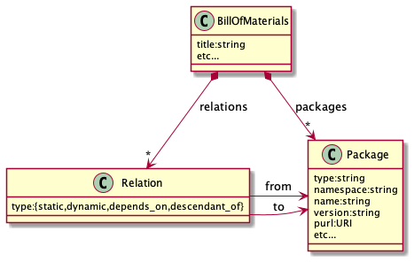
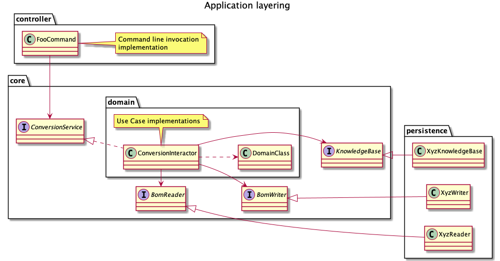
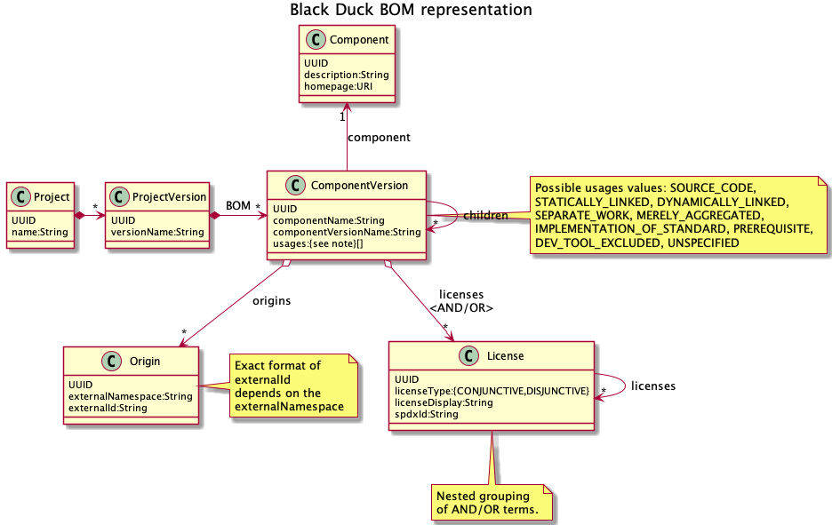

# SPDX-Builder Architecture

## Introduction

### Purpose

This document provides a comprehensive architectural overview of the system,
using a number of different architectural views to depict aspects of the system.
The document is intended to convey the significant architectural decisions which
have been made on the system.

### Scope

The system is an **experimental** tool that generates bill-of-materials reports
in SPDX 2.2 format from various sources to allow further analysis of the
extracted SBOM data.

### Definition, Acronyms and Abbreviations

Term | Description
-----|------------
Package URL | Universal package identifier, see [Package URL specification](https://github.com/package-url/purl-spec).
PURL | Package URL
SBOM | Software Bill-of-Materials
SPDX | "The Software Package Data Exchange" - An open standard for communicating software bill of material information, including components, licenses, copyrights, and security references. SPDX reduces redundant work by providing a common format for companies and communities to share important data, thereby streamlining and improving compliance.

### References

- [Black Duck](https://www.synopsys.com/software-integrity/security-testing/software-composition-analysis.html)
- [BOM-Base](https://github.com/philips-softwre/bom-base)
- [License Scanner Service](https://github.com/philips-softwre/license-scanner)
- [OSS Review Toolkit](https://github.com/oss-review-toolkit/ort)
- [Package URL](https://github.com/package-url/purl-spec)
- [SPDX License list](https://spdx.org/licenses/)
- [SPDX specificationS](https://spdx.github.io/spdx-spec/)

## Goals and constraints

Goals of SPDX-Builder are:

1. Generate SBOM reports for (sample) software development projects.

2. Produce SBOM reports in the standard SPDX format.

3. Enhance data extracted from projects with metadata from an external knowledge
   base.

The stakeholders of this application are:

- CI/CD operators, responsible for running automated build pipelines.
- Consumers of bill-of-materials reports.

The most significant requirements are:

- The generated SBOM report shall comply with the SPDX 2.2 standard.

- The tool shall be easy to integrate into CI/CD build pipelines.

- Metadata from an optional external knowledge base shall be seamlessly
  integrated into the report.

Design constraints are:

- Maintainability: Code must be easy to maintain for average programmers. This
  is why the code tries to adhere to "Clean Code" guidelines, and a strict
  layering model is applied.

## Use-Case view

### Generate SPDX bill-of-materials report

1. CI/CD pipeline starts bill-of-materials extraction.

2. An external source extracts packages, relationships and metadata from the
   build tools of a project.

3. SPDX-Builder retrieves the SBOM data from the selected source.

4. SPDX-Builder requests additional metadata from an external knowledge base for
   every package.

5. The knowledge base provides its metadata per requested package.

6. SPDX-Builder enhances each package with the received metadata.

7. SPDX-Builder writes an SBOM report in valid SPDX format.

8. SPDX-Builder (optionally) uploads the SPDX file to an archive.

#### Variant: Source is OSS Review Toolkit Analyzer

The Analyzer component
of [OSS Review Toolkit](https://github.com/oss-review-toolkit/ort)
uses the build environment to retrieve detailed package metadata from the
backing repository and other locations, yielding an SBOM in its proprietary
format.

In this case the knowledge base consists of
the [License Scanner Service](https://github.com/philips-softwre/license-scanner)
(or [BOM-Base](https://github.com/philips-softwre/bom-base) as compatible
alternative) to add licenses scanned from the source files when the source
location is available from the metadata provided by ORT.

If the declared license provided by ORT does not match the scanned license from
the knowledge base, this licenses is "contested" to the knowledge base. If the
knowledge base indicates the scanned license is "confirmed", SPDX-Builder uses
it as the concluded license (instead of the defaulting to the declared license).

#### Variant: Source is Black Duck

The "hierarchical BOM" API of Black Duck (if enabled) exposes packages and their
relations via an online API that is queried by SPDX-Builder using an
authentication token.

As Black Duck provides an integrated SBOM management environment and knowledge
base, the package metadata is not enhanced by an external knowledge base.

#### Variant: Source is a textual package tree

To reduce coupling with the build environment of projects, a textual tree of
package versions with their hierarchical dependencies is generated by an
appropriate build tool. (Note that manual configuration of a familiar build tool
by a developer reduces the chance of accidental inclusion of directories
containing documentation or e.g. usage samples.)

The tree is parsed using the configured format, such that it can be converted
into a tree of Package URLs.

The [BOM-Base](https://github.com/philips-softwre/bom-base) knowledge base
provides the metadata per Package URL. As harvesting package metadata by
BOM-Base is an asynchronous process, the metadata may not be available on the
first time a package is included in the SBOM. A later CI/CD run would include
the metadata that has meanwhile been harvested (or curated) in BOM-Base.

## Logical view

### Overview

SPDX-Builder is a command-line application that reads SBOM data from a source
and outputs it in SPDX format. Depending on the source, the number of options
to influence and enhance the metadata differ.

The output is formatted in tag-value format according to
the [SPDX 2.2 specification](https://spdx.github.io/spdx-spec).

### Software Bill-of-materials

An SBOM consists of the elements depicted in the figure below:

A `BillOfMaterials` is a container that holds `Package` instances that are
connected by typed `Relation`s. All other information is represented in
attributes of these classes.

## Process view

### Single threaded application

The application runs on a single thread, blocking at every request to an
external REST API. Sequentially reading textual input files and querying
structured data from a server application (like Black Duck) takes most time.
Querying a knowledge base for metadata for a few thousand packages typically
takes just a few seconds.

## Deployment view

The application is a stand-alone Java executable that is invoked from the
command line in a CI/CD pipeline. (The Java environment and application can be
packaged together in a Docker container.)

## Implementation view

### Overview

The service is coded in plain Java because no complex infrastructure is used
that would benefit from an application framework like Spring Boot.

### Layers

The figure below explains how the layers are represented in the source code:

The invocation from the command line wires the concrete persistence
implementation into the application, allowing the core layer to coordinate the
conversion as:

1. Read the package structure using the "BomReader" interface.
2. Enhance the packages using the "KnowledgeBase" interface.
3. Write the resulting SBOM using the "BomWriter" interface.

### Command line handling

To provide a POSIX-compliant CLI, the [picocli](https://picocli.info) library is
used. It converts command line parameters into annotated property fields, and
generates usage instructions using these annotations.

### ORT Analyzer input

The output of
the [ORT Analyzer](https://github.com/oss-review-toolkit/ort#analyzer) is a YAML
file containing all metadata extracted by ORT from the tools found in the build
environment. This file is converted by an object mapper into an object
structure.

Because ORT does not filter at the source, the filters specified in the YAML
file are first applied to remove the irrelevant projects and packages before
populating the SBOM.

_NOTE: ORT is changing its internal metadata format, resulting in degrading
support by SPDX-Builder to read metadata produced by the ORT Analyzer._

### Black Duck input

Black Duck does not natively include an SPDX export function, but instead refers
to an open source [script](https://github.com/blackducksoftware/hub-spdx). The
resulting output does not include any generic external package references that
would allow correlation of packages to external sources (or other SBOM
documents).

A support request to Synopsys about this topic resulted in a
new [Python script](https://github.com/matthewb66/bd_export_spdx2.2) by a Black
Duck consultant, which provides Package URL references but is due to its
dependency on [Black Duck Open Hub](https://www.openhub.net)
not sufficiently performant to realistically export typical JavaScript projects
containing over 1000 package dependencies.

A major limitation of the standard Black Duck API is that despite the existence
of the "direct-dependencies" API per "origin" in the BOM, it _does not
consistently expose this information_ for all projects. Black Duck support
confirmed this limitation and instead suggested the use of
the ["BOM Hierarchical Component" API](https://blackduck.philips.com/api-doc/public.html#_bom_hierarchical_component_endpoints)
. Note that this API needs to be explicitly enabled on the server due to its
(potential) performance impact.

The figure below shows an impression about how Black Duck structures its SBOM
data:

Black Duck stores SBOM data in a "version" of a "project". Each SBOM consists of
components versions, which can be queried recursively using the "hierarchical
id" of the parent to obtain their children.

Note that Black Duck does not explicitly model relationships, and the "usage"
indication is therefore shared between any references to the component version.

### Build tool Tree input

The bill-of-materials structure can be parsed from a textual representation of
the as-built tree that is (preferably) generated from the build tool. The
minimal information necessary is a package name, package version, and
hierarchical relation (=indent level).

The `TreeReader` feeds the tree line-by-line into the configurable `TreeParser`,
which is responsible to convert the input into properly formatted Package URL
values and hierarchical relationships. Configuration is handled by
the `TreeFormats` class which takes its configuration from
the [`treeformats.yml` file](../src/main/resources/treeformats.yml) or
optionally from an external format file. (A description of the format is found
in the [usage documentation](usage_with_tree.md).)

Parsing is makes heavy use of regular expressions both for identification of
markers and to isolate fragments from the input line.

### Knowledge base enhancement

After building a bill-of-materials, any registered knowledge base is used to
enhance the metadata of the registered components. Depending on the type of
knowledge base, this can be limited to license scanning results or extend to any
piece of metadata available from the (external) source.

### SPDX output

The SPDX output is built on a tag-value writer to output values with encoding
of `NOASSERTION` (=no value) and `NONE` (=empty value).

(End of document)
